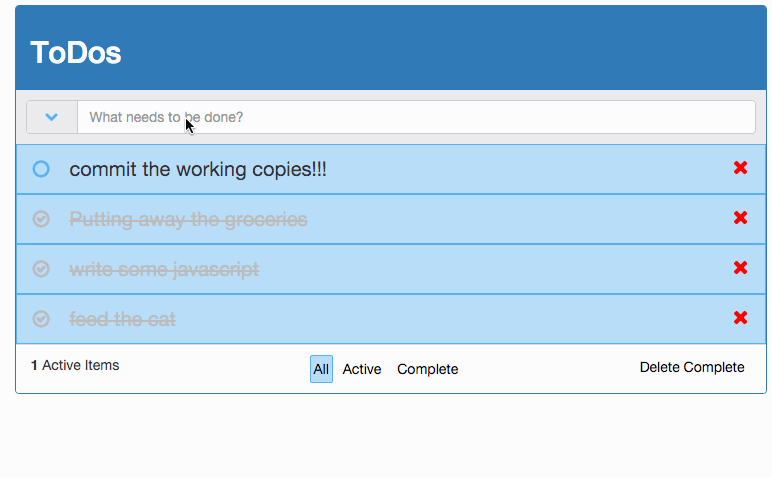
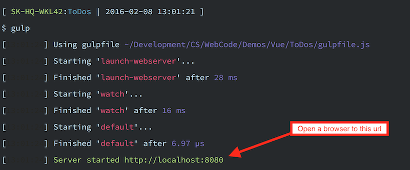

# Vue ToDos

This is a little demo project I made so I could explore a number of things:

- [Vue.js](http://vuejs.org/)
- [Vueify](https://github.com/vuejs/vueify)
- [Gulp](http://gulpjs.com/)
- [Browserify](http://browserify.org/)
- [Node](https://nodejs.org/)
- [npm](https://www.npmjs.com/)

Really, this was an demo to explore a bit more advanced front end js development outside of the js framework I normally use (sencha).

## Prerequisites

To launch this project you'll need [Node.js](https://nodejs.org/en/download/) installed. This will install both Node and npm.

## Install and Launch

To get this project up and running:

- Clone the repo to your computer, open a terminal, and `cd` into the root:

	    cd ~/Desktop
	    git clone https://github.com/chris-schmitz/VueToDos.git VueToDos
	    cd VueToDos

- Install the project dependencies using `npm` (installed when you install node):

	    npm install

- Start the default task in `gulp` (installed when you run npm install):

    	./node_modules/.bin/gulp

- In your terminal you should see the url for the server that this project starts:

   

Open this url in a browser and you should see the app.

## Mockup

I used draw.io to create a [mockup for the demo](https://drive.google.com/file/d/0Bxhfk2Nciu7jY3N3MUFIdzJqcU0/view?usp=sharing) to help plan out the build.

The mockup contains two layers aside from the wireframe; one for general notes and one for structural planning.

Note that you will need a google account to access the mockup in draw.io (the file is stored in google drive).
